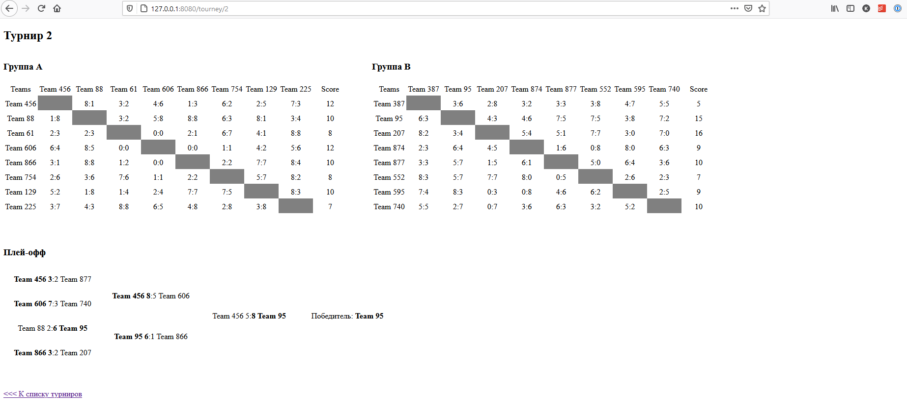

## веб-версия

поднять докер
```
docker-compose up -d
```

Подождать установки всех пакетов в композере.

Запустить миграции
```
docker exec -it tourney_php bin/console doctrine:migrations:migrate
```

И сгенерировать команды

```
docker exec -it tourney_php bin/console doctrine:fixtures:load
```

После этого можно заходить по адресу http://127.0.0.1:8080/ для создания турниров и генерации результатов в них.

## тесты

Для тестов создан отдельный mysql-контейнер dbtest. В нем надо так же выполнить миграции:

```
docker exec -it --env APP_ENV=test tourney_php bin/console doctrine:migrations:migrate
```

сгенерировать команды

```
docker exec -it --env APP_ENV=test tourney_php bin/console doctrine:fixtures:load
```

и после чего уже запускать тесты:

```
docker exec -it --env APP_ENV=test tourney_php vendor/bin/phpunit
```

Реализованы функциональные тесты основного контроллера и unit-тесты вспомогательного функционала (App\Tools).

Весь код отформатирован по PSR12.

Созданный и заполненный турнир выглядит так:



## gg wp
